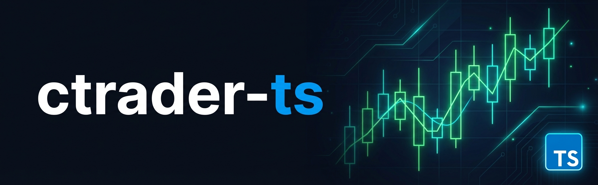

<div align="center">



<br />
<br />

[](https://www.typescriptlang.org/)
[](https://nodejs.org/)
[](LICENSE)
[](https://help.ctrader.com/open-api/)

**Unofficial community TypeScript client for the cTrader Open API**

*Not affiliated with Spotware · Built by the community, for the community* 🤝

</div>

---

## What is this?

There's no official TypeScript SDK for the cTrader Open API. The API itself is a raw protobuf/WebSocket protocol — great for performance, painful to use. This is a community-built client that wraps the JSON WebSocket mode (port 5036) into something actually enjoyable:

```ts
const ct = await connect();
const pos = await ct.buy("EURUSD", { lots: 0.1, sl: { pips: 50 }, tp: { equity: 0.02 } });
await ct.close(pos.positionId);
```

No manual auth flows, no volume unit conversions, no raw WebSocket management.

---

## 🚀 Getting started

**Install from npm:**

```bash
npm install ctrader-ts
```

**Or clone & link globally** (gets you the CLI too):

```bash
git clone https://github.com/thecommandcat/ctrader-ts
cd ctrader-ts
npm install && npm run build && npm link
```

### 🔐 Authenticate

Run the interactive OAuth wizard — walks you through the whole flow in 3 steps:

```bash
ctrader-ts auth
```

You'll need a cTrader Open API app. Create one at [openapi.ctrader.com/apps](https://openapi.ctrader.com/apps), grab your client ID + secret, and the wizard handles the rest. Credentials are saved to `~/.config/ctrader-ts/config.json`.

Prefer env vars? Those work too:

```bash
CTRADER_CLIENT_ID=...
CTRADER_CLIENT_SECRET=...
CTRADER_ACCESS_TOKEN=...
CTRADER_ACCOUNT_ID=...
CTRADER_ENVIRONMENT=demo   # or live
```

---

## 📦 Library

```ts
import { connect } from "ctrader-ts";

const ct = await connect(); // reads stored credentials, connects, authenticates
```

### 📊 Account state

Start here. One call, complete picture:

```ts
const state = await ct.getState();
// {
//   balance, equity, usedMargin, freeMargin,
//   marginLevel, unrealizedPnl,
//   positions, orders, moneyDigits
// }
```

### 💹 Trading

**Market orders** — execute immediately, return the opened `Position` directly:

```ts
const p1 = await ct.buy("EURUSD", { lots: 0.1 });
const p2 = await ct.buy("EURUSD", { lots: 0.05, sl: { pips: 50 }, tp: { pips: 100 } });
const p3 = await ct.sell("USDJPY", { lots: 0.1, sl: { dollars: 30 } });
const p4 = await ct.buy("XAUUSD", { lots: 0.01, sl: { equity: 0.02 } });
```

**Pending orders:**

```ts
await ct.buyLimit("EURUSD",  { lots: 0.1, limitPrice: 1.0800 });
await ct.sellLimit("EURUSD", { lots: 0.1, limitPrice: 1.1200 });
await ct.buyStop("EURUSD",   { lots: 0.1, stopPrice: 1.1050 });
await ct.sellStop("EURUSD",  { lots: 0.1, stopPrice: 1.0950 });
```

### 🎯 SL/TP — three ways, zero math

No manual pip calculations. Every order accepts `sl` and `tp` in whichever unit makes sense:

| | Example | What it means |
|---|---|---|
| **Pips** | `{ pips: 50 }` | 50 pips from entry — symbol-aware (handles JPY, gold, etc.) |
| **Dollars** | `{ dollars: 25 }` | Lose/gain exactly $25 on this trade |
| **Equity %** | `{ equity: 0.02 }` | Risk 2% of your account equity |

The library fetches symbol details and current price automatically to do the conversion.

### 🔧 Position management

Positions use their real cTrader `positionId` — no invented ID system:

```ts
// Move SL/TP at any time
await ct.modify(p1.positionId, { sl: { pips: 30 }, tp: { dollars: 50 } });

// Close — full or partial
await ct.close(p1.positionId);
await ct.close(p1.positionId, { lots: 0.02 });  // partial

// Nuke everything
await ct.closeSymbol("EURUSD");
await ct.closeAll();

// Cancel pending order
await ct.cancelOrder(orderId);
```

### 📡 Live market data

```ts
// Stream bid/ask — returns an unsubscribe function
const stop = await ct.watchSpots(["EURUSD", "GBPUSD"], (price) => {
  console.log(price.symbol, price.bidDecimal, price.askDecimal);
});
await stop(); // done

// Historical candles
const { trendbars } = await ct.getTrendbars("EURUSD", {
  period: TrendbarPeriod.H1,
  count: 100,
});

// Raw tick data
const { ticks } = await ct.getTickData("EURUSD", {
  type: QuoteType.BID,
  fromTimestamp: Date.now() - 3_600_000,
  toTimestamp: Date.now(),
});
```

### 🗂️ History & account data

```ts
const { deals }             = await ct.getDeals({ maxRows: 50 });
const { positions, orders } = await ct.getPositions();
const trader                = await ct.getTrader();
const { margins }           = await ct.getExpectedMargin("EURUSD", [0.1, 0.5, 1.0]);
```

### ⚡ Events

```ts
ct.onExecution((e)         => console.log("fill:", e.executionType, e.position?.positionId));
ct.onOrderError((e)        => console.error("order rejected:", e.errorCode));
ct.onTrailingSLChanged((e) => console.log("trailing SL moved to:", e.stopPrice));
ct.onMarginChanged((e)     => console.log("margin updated:", e.usedMargin));
ct.onTokenInvalidated(()   => console.warn("token expired — run ctrader-ts auth"));
ct.onClientDisconnect((e)  => console.warn("server dropped connection:", e.reason));
```

### 🔩 Raw protocol access

Everything the high-level API doesn't expose is available via `ct.raw`:

```ts
ct.raw.trading.marketRangeOrder({ ... });
ct.raw.account.getDynamicLeverage(leverageId);
ct.raw.market.subscribeLiveTrendbar(symbolId, TrendbarPeriod.M1);
ct.raw.auth.refreshToken(refreshToken);
```

### ⚙️ connect() options

```ts
const ct = await connect({
  environment: "live",   // override stored environment
  accountId: 12345678,   // override stored account
  accessToken: "...",    // override stored token
});
```

---

## 🖥️ CLI

Everything you can do in code, you can do from the terminal.

```bash
# 🔐 Auth
ctrader-ts auth

# 📊 Account
ctrader-ts state
ctrader-ts positions

# 💹 Trade
ctrader-ts buy  EURUSD 0.1 --sl-pips 50 --tp-pips 100
ctrader-ts sell USDJPY 0.1 --sl-dollars 30
ctrader-ts buy  XAUUSD 0.01 --sl-equity 0.02

# 📋 Pending orders
ctrader-ts buy-limit  EURUSD 0.1 1.0800
ctrader-ts sell-limit EURUSD 0.1 1.1200
ctrader-ts buy-stop   EURUSD 0.1 1.1050

# 🔧 Manage positions
ctrader-ts close 12345678                           # full close
ctrader-ts close 12345678 --lots 0.05               # partial
ctrader-ts modify 12345678 --sl-pips 30 --tp-dollars 50
ctrader-ts close-symbol EURUSD
ctrader-ts close-all
ctrader-ts cancel 87654321

# 📡 Market data
ctrader-ts watch EURUSD GBPUSD                      # live prices, Ctrl+C to stop
ctrader-ts bars EURUSD H1 2024-01-01 2024-12-31

# 🗂️ History
ctrader-ts history --from 2024-01-01 --to 2024-12-31

# 🤖 Pipe-friendly JSON output
ctrader-ts state --json
ctrader-ts positions --json | jq '.positions[].positionId'
```

---

## 🤖 For AI agents

Built with AI agents in mind from the start:

- **`getState()` first** — gives a complete picture of the account before making any decisions
- **Human units everywhere** — `{ pips }`, `{ dollars }`, `{ equity }` means no internal encoding knowledge needed
- **Real position IDs** — every `buy()`/`sell()` returns the actual `positionId`, so modifying and closing are unambiguous
- **Typed errors** — agents can react to failures intelligently instead of just crashing
- **CLI with `--json`** — agents with shell access get structured output without a Node runtime in the loop

```ts
import { connect, CTraderError } from "ctrader-ts";

const ct = await connect();
const state = await ct.getState();
// reason about state.equity, state.positions, state.marginLevel...

try {
  const pos = await ct.buy("EURUSD", { lots: 0.1, sl: { equity: 0.01 } });
  console.log("opened", pos.positionId);
} catch (e) {
  if (e instanceof CTraderError) {
    if (e.isAuthError)   { /* re-run auth */ }
    if (e.isRateLimit)   { /* wait e.retryAfter ms then retry */ }
    if (e.isMaintenance) { /* server is down, try later */ }
  }
}
```

---

## 🔄 Reconnection

Drops happen. The library handles it automatically:

- Reconnects with exponential backoff (2s → 60s max)
- Re-authenticates after reconnect (app auth + account auth)
- Restores all active spot / depth / trendbar subscriptions

You don't need to do anything.

---

## License

MIT
